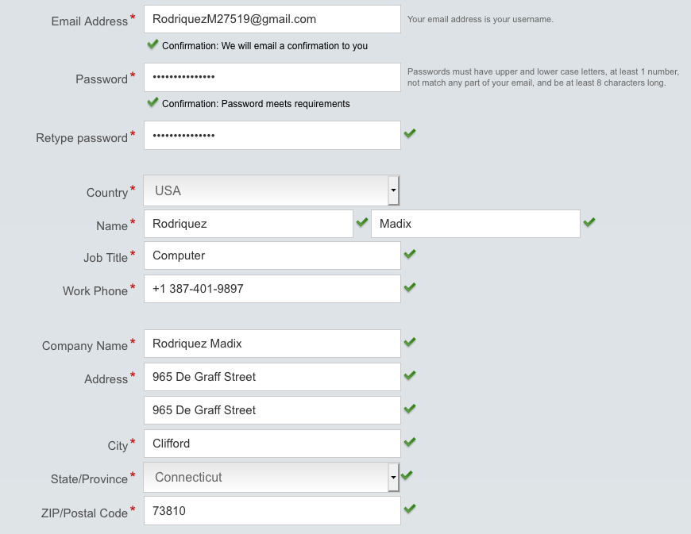

# Logon-Automation
Generates random user info and uses selenium to sign up on websites

# How it works
The program reads in from 2 files to get a list for first names and last names. Then, for each user, random info is generated, such as first name, last name, email, username, password, phone number, zip code, birthday & age, in order to fill in sign up forms.

The program then uses selenium to find places to input data based on key words such as "name", and "pass". After all possible data has been it will press enter and try to sign up.

# Requirements
Selenium and BeautifulSoup are required to run this program:
```
pip install selenium
pip install BeautifulSoup
```

Also, depending on what browser you will use for this, you will have to find and download the appropiate drivers and put them in the correct location on the computer.

Here is the one for Firefox:
https://github.com/mozilla/geckodriver/releases

# Example


